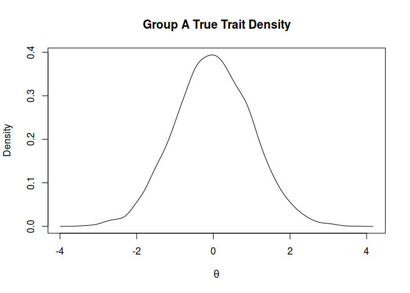
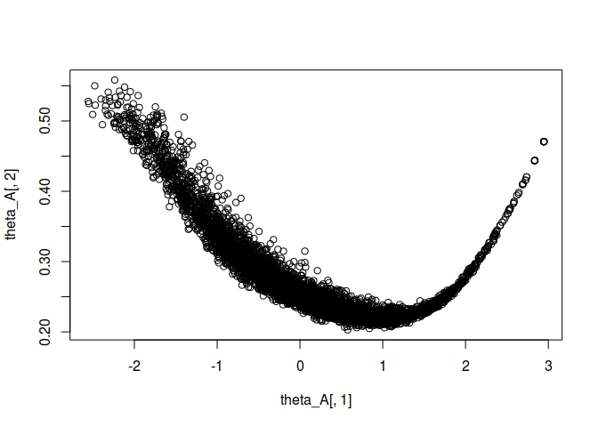

Calibration of Form A
=====================

The mean of *θ* for individuals administrated with form A is 0, the
standard deviation (*S**D* = 1). In the dataset, X is ID, V1 is true
trait (*θ*), V3 to V52 is unique items, V54 to V63 are common items.

0. Look at the data
-------------------

First of all, have a look at the data

``` r
library(mirt)
library(tidyverse)
library(knitr)
### Read in Raw data from Form A:
dat <- read.csv(file="FormA.csv")
glimpse(dat)
```

    ## Observations: 5,000
    ## Variables: 64
    ## $ X   <int> 1, 2, 3, 4, 5, 6, 7, 8, 9, 10, 11, 12, 13, 14, 15, 16, 17,...
    ## $ V1  <dbl> -0.79498, -0.05589, 0.62650, -1.26832, 0.74921, 1.00922, -...
    ## $ V2  <lgl> NA, NA, NA, NA, NA, NA, NA, NA, NA, NA, NA, NA, NA, NA, NA...
    ## $ V3  <int> 0, 1, 1, 1, 1, 1, 0, 1, 0, 1, 1, 1, 1, 1, 1, 1, 1, 1, 0, 1...
    ## $ V4  <int> 0, 1, 1, 0, 1, 1, 1, 1, 1, 1, 1, 1, 1, 1, 0, 1, 1, 1, 1, 1...
    ## $ V5  <int> 1, 0, 1, 0, 1, 1, 1, 1, 1, 1, 0, 1, 0, 1, 0, 1, 1, 1, 0, 1...
    ## $ V6  <int> 0, 0, 1, 1, 1, 0, 0, 0, 0, 1, 0, 1, 1, 1, 1, 1, 0, 1, 0, 1...
    ## $ V7  <int> 0, 0, 0, 0, 1, 0, 0, 0, 0, 0, 0, 1, 0, 0, 0, 1, 0, 0, 0, 1...
    ## $ V8  <int> 1, 1, 1, 0, 1, 0, 1, 1, 1, 1, 1, 1, 1, 0, 0, 1, 1, 0, 1, 0...
    ## $ V9  <int> 0, 0, 0, 0, 1, 0, 1, 1, 0, 1, 1, 0, 1, 0, 0, 1, 0, 1, 1, 0...
    ## $ V10 <int> 0, 0, 1, 1, 1, 0, 0, 0, 0, 0, 1, 1, 0, 0, 1, 0, 1, 0, 0, 1...
    ## $ V11 <int> 0, 1, 1, 1, 0, 1, 0, 0, 1, 1, 0, 1, 1, 0, 0, 1, 0, 1, 0, 1...
    ## $ V12 <int> 0, 1, 1, 0, 1, 1, 1, 0, 1, 0, 0, 0, 0, 0, 0, 1, 0, 0, 0, 1...
    ## $ V13 <int> 0, 0, 0, 1, 0, 1, 0, 0, 1, 1, 0, 1, 0, 0, 0, 0, 1, 0, 1, 0...
    ## $ V14 <int> 0, 1, 1, 0, 1, 1, 0, 1, 1, 1, 0, 1, 1, 1, 0, 1, 1, 1, 0, 1...
    ## $ V15 <int> 0, 0, 0, 1, 1, 1, 0, 1, 0, 1, 0, 0, 1, 0, 0, 0, 0, 1, 1, 1...
    ## $ V16 <int> 1, 1, 1, 1, 1, 1, 1, 0, 1, 1, 1, 1, 1, 1, 0, 0, 0, 1, 0, 0...
    ## $ V17 <int> 0, 0, 1, 0, 1, 0, 0, 1, 0, 0, 0, 0, 0, 0, 0, 0, 0, 0, 0, 0...
    ## $ V18 <int> 0, 0, 1, 1, 0, 1, 0, 1, 1, 1, 0, 1, 1, 0, 0, 1, 1, 1, 1, 1...
    ## $ V19 <int> 1, 1, 1, 0, 0, 0, 0, 1, 1, 1, 0, 1, 1, 1, 1, 1, 0, 0, 1, 1...
    ## $ V20 <int> 1, 0, 0, 0, 1, 1, 0, 0, 1, 1, 1, 1, 1, 0, 1, 0, 0, 1, 0, 0...
    ## $ V21 <int> 1, 1, 1, 0, 1, 0, 1, 1, 0, 1, 1, 1, 1, 1, 1, 1, 1, 1, 1, 1...
    ## $ V22 <int> 0, 0, 1, 0, 0, 1, 0, 0, 0, 0, 0, 1, 0, 0, 0, 1, 0, 0, 0, 0...
    ## $ V23 <int> 0, 0, 0, 0, 1, 1, 1, 1, 1, 1, 0, 1, 0, 0, 0, 0, 0, 1, 0, 1...
    ## $ V24 <int> 0, 1, 1, 0, 1, 1, 0, 0, 0, 1, 1, 1, 1, 0, 0, 1, 1, 1, 0, 1...
    ## $ V25 <int> 0, 1, 0, 1, 0, 0, 1, 0, 0, 1, 1, 1, 0, 0, 0, 0, 0, 0, 0, 1...
    ## $ V26 <int> 0, 0, 1, 0, 1, 1, 0, 1, 0, 1, 0, 1, 1, 1, 0, 1, 1, 0, 0, 1...
    ## $ V27 <int> 0, 0, 0, 0, 1, 1, 0, 0, 0, 1, 0, 1, 0, 0, 1, 0, 0, 1, 0, 0...
    ## $ V28 <int> 0, 0, 0, 0, 0, 0, 0, 0, 0, 0, 0, 1, 0, 0, 0, 0, 1, 1, 0, 1...
    ## $ V29 <int> 0, 0, 0, 0, 1, 0, 0, 1, 0, 1, 1, 1, 0, 0, 0, 1, 0, 1, 0, 0...
    ## $ V30 <int> 1, 0, 1, 0, 1, 0, 0, 1, 1, 1, 0, 1, 1, 1, 0, 0, 0, 1, 1, 1...
    ## $ V31 <int> 1, 1, 0, 0, 0, 1, 0, 0, 1, 1, 0, 1, 0, 0, 1, 1, 1, 1, 1, 1...
    ## $ V32 <int> 0, 0, 1, 0, 1, 0, 0, 1, 1, 1, 1, 1, 1, 1, 0, 1, 0, 1, 0, 1...
    ## $ V33 <int> 0, 0, 1, 0, 1, 1, 0, 0, 0, 1, 0, 1, 0, 1, 0, 0, 0, 1, 0, 1...
    ## $ V34 <int> 1, 1, 0, 1, 1, 0, 1, 1, 1, 1, 0, 1, 1, 1, 1, 1, 0, 1, 1, 1...
    ## $ V35 <int> 0, 0, 1, 1, 1, 1, 1, 0, 1, 1, 1, 1, 0, 1, 1, 1, 0, 1, 1, 1...
    ## $ V36 <int> 0, 1, 0, 0, 1, 1, 1, 1, 1, 1, 0, 1, 1, 1, 0, 1, 1, 1, 1, 1...
    ## $ V37 <int> 0, 1, 1, 0, 1, 1, 1, 1, 1, 1, 1, 1, 1, 1, 0, 1, 0, 1, 0, 1...
    ## $ V38 <int> 1, 0, 0, 0, 0, 1, 1, 1, 0, 0, 1, 1, 0, 0, 0, 1, 1, 0, 0, 0...
    ## $ V39 <int> 1, 1, 1, 0, 0, 1, 1, 1, 1, 1, 1, 1, 0, 1, 0, 1, 0, 1, 1, 1...
    ## $ V40 <int> 0, 0, 1, 0, 1, 1, 0, 0, 1, 1, 0, 1, 1, 0, 1, 1, 1, 0, 1, 1...
    ## $ V41 <int> 0, 1, 1, 0, 1, 1, 1, 0, 1, 1, 0, 1, 1, 1, 0, 1, 1, 1, 1, 1...
    ## $ V42 <int> 0, 0, 0, 0, 1, 0, 1, 0, 1, 0, 0, 1, 0, 0, 0, 1, 0, 0, 0, 0...
    ## $ V43 <int> 1, 0, 1, 1, 1, 1, 0, 1, 1, 1, 1, 1, 1, 1, 0, 1, 1, 1, 0, 1...
    ## $ V44 <int> 0, 0, 1, 0, 0, 0, 1, 0, 0, 1, 1, 1, 0, 0, 0, 1, 0, 0, 1, 1...
    ## $ V45 <int> 1, 1, 0, 0, 1, 1, 1, 1, 0, 1, 1, 1, 0, 1, 0, 1, 0, 0, 0, 1...
    ## $ V46 <int> 0, 0, 1, 0, 0, 1, 1, 0, 0, 0, 1, 1, 0, 0, 1, 1, 0, 1, 0, 1...
    ## $ V47 <int> 0, 0, 0, 1, 1, 0, 1, 0, 1, 1, 1, 1, 0, 0, 0, 1, 0, 0, 1, 1...
    ## $ V48 <int> 0, 0, 1, 0, 1, 0, 0, 0, 0, 1, 0, 1, 0, 1, 0, 0, 1, 0, 1, 0...
    ## $ V49 <int> 0, 0, 0, 0, 1, 0, 1, 0, 0, 1, 1, 1, 0, 0, 1, 1, 1, 0, 1, 1...
    ## $ V50 <int> 0, 1, 0, 1, 1, 1, 1, 0, 0, 1, 0, 1, 0, 0, 0, 0, 0, 1, 0, 1...
    ## $ V51 <int> 0, 0, 0, 1, 0, 0, 1, 0, 1, 1, 0, 1, 0, 1, 0, 1, 1, 0, 0, 0...
    ## $ V52 <int> 0, 1, 0, 0, 0, 0, 0, 1, 0, 0, 0, 1, 0, 0, 0, 0, 0, 1, 0, 1...
    ## $ V53 <lgl> NA, NA, NA, NA, NA, NA, NA, NA, NA, NA, NA, NA, NA, NA, NA...
    ## $ V54 <int> 1, 1, 1, 1, 1, 1, 0, 1, 1, 1, 1, 1, 1, 1, 1, 1, 0, 1, 1, 1...
    ## $ V55 <int> 0, 0, 1, 1, 0, 1, 0, 0, 0, 1, 1, 1, 0, 0, 0, 0, 0, 1, 0, 0...
    ## $ V56 <int> 0, 0, 1, 0, 0, 1, 0, 1, 0, 0, 0, 1, 1, 1, 1, 1, 0, 0, 1, 1...
    ## $ V57 <int> 0, 0, 0, 1, 0, 1, 0, 1, 1, 0, 0, 1, 1, 1, 0, 0, 0, 1, 0, 1...
    ## $ V58 <int> 0, 0, 1, 0, 1, 1, 0, 0, 0, 1, 0, 1, 0, 1, 1, 1, 0, 0, 0, 1...
    ## $ V59 <int> 1, 0, 1, 0, 1, 0, 0, 1, 1, 1, 0, 1, 1, 0, 1, 1, 0, 1, 0, 1...
    ## $ V60 <int> 0, 1, 1, 0, 1, 0, 1, 1, 0, 1, 1, 1, 0, 1, 0, 1, 0, 0, 0, 1...
    ## $ V61 <int> 1, 0, 0, 0, 1, 1, 0, 1, 0, 1, 0, 1, 0, 0, 1, 1, 0, 1, 0, 1...
    ## $ V62 <int> 0, 0, 0, 0, 0, 0, 0, 0, 1, 1, 0, 1, 0, 0, 1, 0, 0, 0, 0, 1...
    ## $ V63 <int> 0, 1, 1, 1, 1, 1, 0, 1, 1, 1, 0, 1, 1, 1, 1, 1, 0, 0, 1, 1...

1. Plot the density of true *θ* of Group A
------------------------------------------

From the density function, *m**u*<sub>*θ*</sub> is 0,
*s**d*<sub>*θ*</sub> is 1.

``` r
plot(density(dat$V1), main = "Group A True Trait Density", 
     xlab=expression(theta) )
```



2. CTT Table
------------

CTT table could provide a brief description of table. 2 key valables in
the table is item difficulty (*item.diff*) calculated by item means
*P*(*y* = 1) and item discrimination (item.disc), which is item-total
correlation.

\#\#\#2.1 Clean data By cleaning, data has 60 items including 50 unique
item (from item1 to item50) and 10 common items (from item51 to item60).
The sample size is 5000.

``` r
dat_cali <- dat %>% select(V3:V52, V54:V63)
colnames(dat_cali) <- paste0("item",1:60)
N <- nrow(dat_cali)
n <- ncol(dat_cali)
```

\#\#\#2.2 Classical Test Theory Then calculate the CTT table for Form A.
The item discrimination and difficulty could be compared between Form A
and Form B. Because the relationship between trait and total score is
non-linear, so there is effect of shrinkage.

``` r
# item stats
## item discrimnation
item.disc <- apply(dat_cali, 2, function(x) cor(x, rowSums(dat_cali, na.rm = TRUE)))

## item difficulty
item.diff <- colMeans(dat_cali)

## item response frequency
item.freq <- reduce(lapply(dat_cali, table), bind_rows)

CTT <- cbind(item.disc, item.diff, item.freq)

kable(CTT, digits = 3, caption = "CTT Table for Form A")
```

|        |  item.disc|  item.diff|     0|     1|
|--------|----------:|----------:|-----:|-----:|
| item1  |      0.365|      0.761|  1197|  3803|
| item2  |      0.464|      0.833|   835|  4165|
| item3  |      0.457|      0.539|  2305|  2695|
| item4  |      0.471|      0.524|  2380|  2620|
| item5  |      0.385|      0.221|  3893|  1107|
| item6  |      0.400|      0.563|  2183|  2817|
| item7  |      0.261|      0.457|  2717|  2283|
| item8  |      0.264|      0.365|  3176|  1824|
| item9  |      0.331|      0.560|  2198|  2802|
| item10 |      0.505|      0.431|  2843|  2157|
| item11 |      0.306|      0.354|  3228|  1772|
| item12 |      0.528|      0.560|  2199|  2801|
| item13 |      0.362|      0.550|  2251|  2749|
| item14 |      0.427|      0.761|  1196|  3804|
| item15 |      0.433|      0.241|  3793|  1207|
| item16 |      0.377|      0.458|  2710|  2290|
| item17 |      0.524|      0.545|  2275|  2725|
| item18 |      0.351|      0.578|  2112|  2888|
| item19 |      0.429|      0.509|  2455|  2545|
| item20 |      0.330|      0.307|  3465|  1535|
| item21 |      0.399|      0.403|  2984|  2016|
| item22 |      0.418|      0.609|  1957|  3043|
| item23 |      0.356|      0.354|  3232|  1768|
| item24 |      0.460|      0.670|  1651|  3349|
| item25 |      0.388|      0.507|  2465|  2535|
| item26 |      0.209|      0.310|  3451|  1549|
| item27 |      0.242|      0.476|  2618|  2382|
| item28 |      0.495|      0.502|  2492|  2508|
| item29 |      0.441|      0.481|  2593|  2407|
| item30 |      0.450|      0.731|  1344|  3656|
| item31 |      0.601|      0.399|  3006|  1994|
| item32 |      0.396|      0.682|  1588|  3412|
| item33 |      0.584|      0.613|  1933|  3067|
| item34 |      0.489|      0.557|  2216|  2784|
| item35 |      0.467|      0.759|  1203|  3797|
| item36 |      0.312|      0.367|  3166|  1834|
| item37 |      0.410|      0.778|  1109|  3891|
| item38 |      0.443|      0.571|  2143|  2857|
| item39 |      0.519|      0.755|  1224|  3776|
| item40 |      0.280|      0.327|  3365|  1635|
| item41 |      0.413|      0.582|  2088|  2912|
| item42 |      0.338|      0.395|  3024|  1976|
| item43 |      0.430|      0.634|  1830|  3170|
| item44 |      0.348|      0.382|  3088|  1912|
| item45 |      0.370|      0.530|  2351|  2649|
| item46 |      0.286|      0.337|  3314|  1686|
| item47 |      0.456|      0.403|  2985|  2015|
| item48 |      0.340|      0.397|  3014|  1986|
| item49 |      0.310|      0.291|  3544|  1456|
| item50 |      0.435|      0.357|  3214|  1786|
| item51 |      0.283|      0.821|   895|  4105|
| item52 |      0.272|      0.324|  3382|  1618|
| item53 |      0.474|      0.531|  2347|  2653|
| item54 |      0.298|      0.336|  3318|  1682|
| item55 |      0.427|      0.546|  2271|  2729|
| item56 |      0.471|      0.667|  1667|  3333|
| item57 |      0.410|      0.470|  2652|  2348|
| item58 |      0.483|      0.433|  2834|  2166|
| item59 |      0.363|      0.232|  3841|  1159|
| item60 |      0.376|      0.666|  1670|  3330|

3. Calibration of Form A
------------------------

### 3.1 Model Specification

``` r
SPECS <- mirt.model('F = 1-60
                    PRIOR = (1-60, a1, lnorm, 0, 1),
                    (1-60,  d,  norm, 0, 1),
                    (1-60,  g,  norm, -1.39,1)')
mod_A3PL <- mirt(data=dat_cali, model=SPECS, itemtype='3PL')
parms <- coef(mod_A3PL, simplify=TRUE, IRTpars = TRUE)$items
```

``` r
a_A <- parms[,1] 
b_A <- parms[,2] 
c_A <- parms[,3] 
theta_A <- fscores(mod_A3PL,method="EAP",
                   full.scores=TRUE, full.scores.SE=TRUE,
                   scores.only=TRUE)
head(theta_A, 20) %>% kable(digits = 3, caption = "Model-implied Theta of A")
```

|      F1|  SE\_F1|
|-------:|-------:|
|  -1.183|   0.350|
|  -0.341|   0.259|
|   0.576|   0.220|
|  -1.396|   0.410|
|   0.876|   0.219|
|   0.434|   0.237|
|  -0.442|   0.272|
|   0.060|   0.263|
|   0.136|   0.247|
|   1.235|   0.217|
|  -0.536|   0.284|
|   2.182|   0.310|
|   0.015|   0.240|
|   0.165|   0.238|
|  -1.299|   0.466|
|   0.842|   0.226|
|  -0.921|   0.343|
|   0.422|   0.230|
|  -0.560|   0.313|
|   1.276|   0.220|

Using 3-PL for irt model of form A. Extracting the cofficients (a, b, c)
of IRT. The model-implied theta was outputed, whose mean is 0.131738

The plot below suggest that SE is low when theta is close to mean, but
low theta and high theta has large SE.

``` r
plot(theta_A[,1],theta_A[,2])
```


