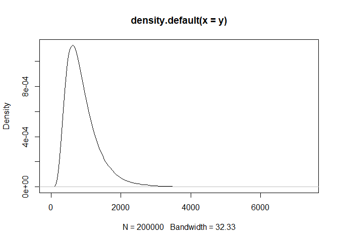

This post is about simulating lognormal distribution. Lognormal distribution used a lot in cumulative data (e.x. counting). But I always have no idea about parameterized this distribution.

Simulate lognomal distibution
-----------------------------

### Simulation Study 1

This is to simulate lognormal distribution based on mean and sd of depedent variable (Y). My simulated mean of y is 891, and sd is 490, N (sample size) is 200000. Then use the formular below

``` r
mu  = log(m^2/phi) # log mean
sigma = sqrt(log(1+v/m^2)) # log sd
```

to calculate the log mean and log sd for lognormal distribution.

``` r
set.seed(20171108)

#### Give Y mean and Y sd, simluate lognormal distribution data.
m = 891 # geometric mean
sd = 490 # geometric sd
v = sd ^ 2
phi = sqrt(v + m^2) 

mu    = log(m^2/phi) # log mean
sigma = sqrt(log(1+v/m^2)) # log sd
  

y <- rlnorm(n = 200000, mu, sigma) %>% round(0)
m.sim <- mean(y) # should be close to 891
sd.sim <- sd(y) # should be close to 490

row1 <- c(m, mu,m.sim)
row2 <- c(sd, sigma,sd.sim)
table <- rbind(row1, row2)
colnames(table) <- c("Original", "Log", "Simulated")
rownames(table)  <- c("Mean", "SD")
kable(table) 
```

|      |  Original|       Log|  Simulated|
|------|---------:|---------:|----------:|
| Mean |       891|  6.660225|   891.1468|
| SD   |       490|  0.514041|   490.4396|

``` r
plot(density(y))
```


